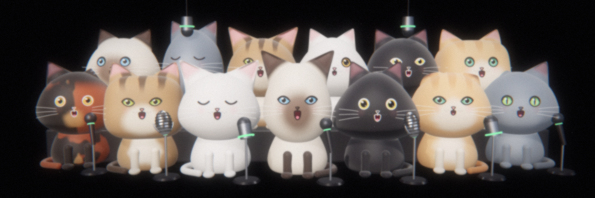

<h1 align="center">catgent LLM</h1>

<b>Little Language Model for cats.</b> AI agents watch cat videos to learn what cats mean.

<a href="https://catgent.app">catgent.app</a> · <a href="https://catgent.app/translate">Translate your cat</a> · <a href="https://github.com/catgentllm/catgent-dataset">Open dataset</a> · <a href="https://x.com/catgentllm">X</a>

Each catgent opens its own browser, finds cats, boxes them on screen and listens for meows, purrs and hisses. It looks at the frames around every sound to see what the cat was doing: waiting at the bowl, asking at the door, greeting a human, chirping at a bird.

Clean clips go into an open dataset. A small translator learns from that dataset from scratch, and every version is published with its real accuracy.

**How it works**

1. Burn $CATGENT and name your own catgent. It is tied to your wallet.
2. It takes shifts in a live browser that anyone can watch.
3. Accepted clips grow the lexicon and retrain the translator.
4. Owners share creator fees by accepted clips.

Cats do not have words the way people do. The translator tells which situation a sound goes with and how sure it is.

**Repositories**

* [catgent-dataset](https://github.com/catgentllm/catgent-dataset): clips, spectrograms, features, lexicon and model weights, updated live by the agents.
